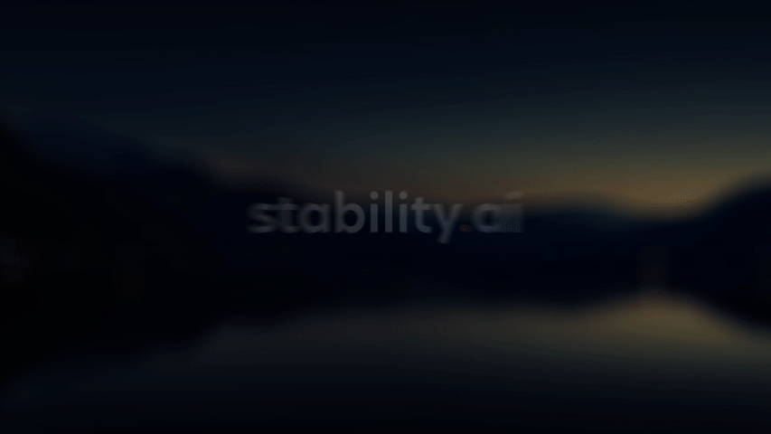

# Stable Video 4D

**Stable Video 4D (SV4D)** is a generative model based on [Stable Video Diffusion (SVD)](https://huggingface.co/stabilityai/stable-video-diffusion-img2vid-xt) and [Stable Video 3D (SV3D)](https://huggingface.co/stabilityai/sv3d), which takes in a single-view video of an object and generates multiple novel-view videos (4D image matrix) of that object.

Please note: For individuals  or organizations generating annual revenue of US $1,000,000 (or local currency equivalent) or more, regardless of the source of that revenue, you must obtain an enterprise commercial license directly from Stability AI before commercially using SV4D, or any derivative work of SV4D or its outputs, such as “fine tune” or “low-rank adaption” models. You may submit a request for an Enterprise License at https://stability.ai/enterprise. Please refer to Stability AI’s Community License, available at https://stability.ai/license, for more information.

### Model Description

* **Developed by**: [Stability AI](https://stability.ai/)
* **Model type**: Generative video-to-video model
* **Model details**: This model is trained to generate 40 frames (5 video frames x 8 camera views) at 576x576 resolution, given 5 reference frames of the same size. 
To generate a 5x8 image matrix from a single view video, first run SV3D on the first input frame to generate an orbital video following a specified camera path, then use the orbital video as SV4D's reference views, and input video as reference frames, as conditioning for 4D sampling.
To generate longer novel-view videos, we use the first generated frames as anchors, and then densely sample (interpolate) the remaining frames.
Please check our [tech report] and [video summary] for details.

### License

- **Community License:** Free for research, non-commercial, and commercial use by organizations and individuals generating annual revenue of US $1,000,000 (or local currency equivalent) or less, regardless of the source of that revenue. If your annual revenue exceeds US $1M, any commercial use of this model or derivative works thereof requires obtaining an Enterprise License directly from Stability AI. You may submit a request for an Enterprise License at https://stability.ai/enterprise. Please refer to Stability AI’s Community License, available at https://stability.ai/license, for more information.

### Model Sources

* **Repository**: https://github.com/Stability-AI/generative-models
* **Tech report**: https://sv4d.github.io/static/sv4d_technical_report.pdf
* **Video summary**: https://www.youtube.com/watch?v=RBP8vdAWTgk
* **Project page**: https://sv4d.github.io
* **arXiv page**: https://arxiv.org/abs/2407.17470

### Training Dataset

We use renders from the [Objaverse](https://objaverse.allenai.org/) dataset, available under the Open Data Commons Attribution License, utilizing our enhanced rendering method that more closely replicates the distribution of images found in the real world, significantly improving our model's ability to generalize. We filter objects based on the review of licenses and curated a subset suitable for our training needs.

## Usage

For usage instructions, please refer to our [generative models GitHub repository](https://github.com/Stability-AI/generative-models)

### Intended Uses

Intended uses include the following: 
* Generation of artworks and use in design and other artistic processes.
* Applications in educational or creative tools.
* Research on generative models, including understanding the limitations of generative models.

All uses of the model should be in accordance with our [Acceptable Use Policy](https://stability.ai/use-policy).

### Out-of-Scope Uses

The model was not trained to be factual or true representations of people or events.  As such, using the model to generate such content is out-of-scope of the abilities of this model.

## Safety

As part of our safety-by-design and responsible AI deployment approach, we implement safety measures throughout the development of our models, from the time we begin pre-training a model to the ongoing development, fine-tuning, and deployment of each model. We have implemented a number of safety mitigations that are intended to reduce the risk of severe harms. However, we recommend that developers conduct their own testing and apply additional mitigations based on their specific use cases.  
For more about our approach to Safety, please visit our [Safety page](https://stability.ai/safety).

### Contact

Please report any issues with the model or contact us:

* Safety issues:  safety@stability.ai
* Security issues:  security@stability.ai
* Privacy issues:  privacy@stability.ai 
* License and general: https://stability.ai/license
* Enterprise license: https://stability.ai/enterprise
